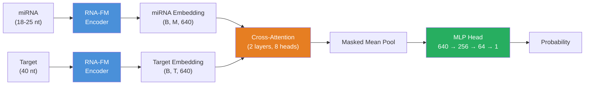
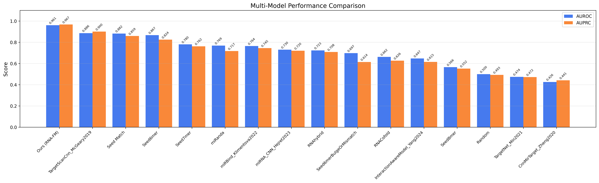

<p align="center">
  <h1 align="center">DeepMiRT</h1>
  <p align="center">
    <strong>miRNA Target Prediction with RNA Foundation Models</strong>
  </p>
  <p align="center">
    <a href="https://pypi.org/project/deepmirt/"></a>
    <a href="https://huggingface.co/liuliu2333/deepmirt"></a>
    <a href="https://huggingface.co/spaces/liuliu2333/deepmirt"></a>
    <a href="LICENSE"></a>
    <a href="https://www.python.org/"></a>
    
  </p>
</p>

DeepMiRT predicts miRNA-target interactions using [RNA-FM](https://github.com/ml4bio/RNA-FM) embeddings and cross-attention, ranking **#1 on eCLIP benchmarks** among 12 methods.

---

## Why DeepMiRT?

Existing miRNA target prediction tools rely on hand-crafted thermodynamic rules or shallow sequence features, struggling to capture the full complexity of miRNA-target recognition. DeepMiRT addresses this by leveraging **RNA-FM**, a foundation model pre-trained on 23 million non-coding RNAs, as a shared encoder for both miRNA and target. A **cross-attention** mechanism then lets the target "read" the miRNA to learn complementarity patterns beyond simple seed matching. The result: state-of-the-art performance, ranking **#1 among 12 methods** on eCLIP benchmarks and achieving **0.96 AUROC** on a held-out test set of 813K samples.

## Key Results at a Glance

<table>
<tr>
<td align="center"><strong>0.96</strong><br>AUROC</td>
<td align="center"><strong>#1 / 12</strong><br>eCLIP Benchmark</td>
<td align="center"><strong>813K</strong><br>Test Samples</td>
<td align="center"><strong>3-line</strong><br>Python API</td>
</tr>
</table>

## Quick Start

```bash
pip install deepmirt
```

```python
from deepmirt import predict

probs = predict(
    mirna_seqs=["UGAGGUAGUAGGUUGUAUAGUU"],
    target_seqs=["ACUGCAGCAUAUCUACUAUUUGCUACUGUAACCAUUGAUCU"],
)
print(f"Interaction probability: {probs[0]:.4f}")
```

Model weights are automatically downloaded from Hugging Face Hub on first use (~495 MB).

## Architecture



The model uses a **shared RNA-FM encoder** for both sequences, ensuring they lie in the same representation space. Cross-attention lets the target "read" the miRNA to capture complementarity and binding signals. Two-phase training first optimizes the classifier (frozen backbone), then fine-tunes the top 3 RNA-FM layers.

<details>
<summary>ASCII diagram (fallback)</summary>

```
miRNA  (18-25 nt) ──→ [RNA-FM Encoder] ──→ miRNA embedding (B, M, 640) ──────────┐
                        (shared weights)                                           ↓
Target (40 nt)    ──→ [RNA-FM Encoder] ──→ target embedding (B, T, 640) → [Cross-Attention]
                                                                                   ↓
                                                                          Masked Mean Pool
                                                                                   ↓
                                                                              [MLP Head]
                                                                           640 → 256 → 64 → 1
                                                                                   ↓
                                                                             probability
```

</details>

## Genome-Wide Target Scanning

DeepMiRT can scan entire 3'UTR or transcript sequences to identify binding sites genome-wide -- similar to miRanda, but powered by the deep learning model.

### Python API

```python
from deepmirt import scan_targets

results = scan_targets(
    mirna_fasta="mirnas.fa",           # or dict: {"let-7": "UGAGGUAGUAGGUUGUAUAGUU"}
    target_fasta="3utrs.fa",
    output_prefix="results/scan",      # writes _details.txt, _hits.tsv, _summary.tsv
    device="cuda",
    scan_mode="hybrid",                # "seed" | "hybrid" | "exhaustive"
    prob_threshold=0.5,
)

for r in results:
    for hit in r.hits:
        print(f"{r.target_id} pos={hit.position} prob={hit.probability:.3f} ({hit.seed_type})")
```

### Command Line

```bash
# Scan with a FASTA of miRNAs against target 3'UTRs
deepmirt-predict scan \
    --mirna-fasta mirnas.fa \
    --target-fasta 3utrs.fa \
    --output results/scan \
    --device cuda \
    --scan-mode hybrid \
    --threshold 0.5

# Scan with a single miRNA sequence
deepmirt-predict scan \
    --mirna UGAGGUAGUAGGUUGUAUAGUU \
    --mirna-id dme-let-7 \
    --target-fasta 3utrs.fa \
    --output results/scan \
    --device cpu
```

### Scanning Modes

| Mode | Strategy | Speed | Use Case |
|------|----------|-------|----------|
| `seed` | Only score seed match positions (8mer/7mer/6mer) | Fastest | Quick screen, high-confidence sites |
| `hybrid` | Seed matches + sliding window (stride=20) to fill gaps | Default | Balanced: catches seed + non-canonical sites |
| `exhaustive` | Sliding window across entire target | Slowest | Comprehensive, catches everything |

### Output Files

| File | Description |
|------|-------------|
| `{prefix}_details.txt` | Human-readable report with ASCII alignment for each hit |
| `{prefix}_hits.tsv` | Per-hit table: position, probability, seed type, window sequence |
| `{prefix}_summary.tsv` | Per-target summary: number of hits, max/mean probability |

Example alignment from `_details.txt`:

```
Scanning: dme-miR-1-3p vs FBTR0082186_3UTR (1247 nt)
  Hits found: 2

  Hit at position 617, Prob: 0.8923, Seed: 7mer-m8

    miRNA  3' ...uauCCGCGGCCggg... 5'
                  ||||||||::
    Target 5' ...aGGCGCCGGAact... 3'
```

## Installation

### From PyPI

```bash
pip install deepmirt
```

### From source (for development)

```bash
git clone https://github.com/zichengll/DeepMiRT.git
cd DeepMiRT
pip install -e ".[dev,eval]"
```

### Requirements

- Python >= 3.9
- PyTorch >= 1.12
- RNA-FM (`rna-fm` package)
- ~495 MB disk space for model weights (auto-downloaded)

## Usage

### Python API

```python
from deepmirt import predict

# Single pair
probs = predict(
    mirna_seqs=["UGAGGUAGUAGGUUGUAUAGUU"],
    target_seqs=["ACUGCAGCAUAUCUACUAUUUGCUACUGUAACCAUUGAUCU"],
)

# Multiple pairs
probs = predict(
    mirna_seqs=["UGAGGUAGUAGGUUGUAUAGUU", "UAGCAGCACGUAAAUAUUGGCG"],
    target_seqs=["ACUGCAGCAUAUCUACUAUUUGCUACUGUAACCAUUGAUCU",
                 "GCAAUGUUUUCCACAGUGCUUACACAGAAAUAGCAACUUUA"],
    device="cuda",  # use GPU if available
)
```

### CSV Batch Prediction

```python
from deepmirt.predict import predict_from_csv

df = predict_from_csv(
    csv_path="input.csv",         # must have mirna_seq and target_seq columns
    output_path="results.csv",
    device="cpu",
)
```

### Command Line

```bash
# Single pair
deepmirt-predict single --mirna UGAGGUAGUAGGUUGUAUAGUU \
    --target ACUGCAGCAUAUCUACUAUUUGCUACUGUAACCAUUGAUCU

# Batch from CSV
deepmirt-predict batch --input data.csv --output results.csv --device cuda
```

### Input Format

- **miRNA sequences**: 18-25 nt, DNA (T) or RNA (U) format
- **Target sequences**: 40 nt recommended (the model was trained on 40-nt target site fragments)
- Sequences are automatically converted to RNA format internally

### Web Demo

Try DeepMiRT without installation:
**[huggingface.co/spaces/liuliu2333/deepmirt](https://huggingface.co/spaces/liuliu2333/deepmirt)**

The demo supports single-pair prediction with pre-loaded examples and batch CSV upload.

## Benchmark Results

### Standard Benchmark: miRBench eCLIP Datasets

DeepMiRT ranks **#1** on both eCLIP benchmark datasets from miRBench (fair comparison -- all methods evaluated on the same held-out data by the benchmark authors):

| Method | Type | eCLIP Klimentova 2022 | eCLIP Manakov 2022 |
|--------|------|-----------------------|--------------------|
| **DeepMiRT (ours)** | **DL + LM** | **0.7511** | **0.7543** |
| TargetScanCnn | CNN | 0.7138 | 0.7205 |
| miRBind | DL | 0.7004 | -- |
| miRNA_CNN | CNN | 0.6981 | -- |
| RNACofold | Thermo. | -- | 0.6841 |

### Standard Benchmark: miRBench CLASH Dataset

On the CLASH dataset, DeepMiRT ranks #5 (honest reporting -- CLASH captures different biology):

| Method | AUROC |
|--------|-------|
| miRBind | 0.7649 |
| miRNA_CNN | 0.7614 |
| InteractionAwareModel | 0.7510 |
| RNACofold | 0.7455 |
| **DeepMiRT (ours)** | **0.6952** |

### Our Test Set (813K samples)

| Method | Type | AUROC | AUPRC | F1 | MCC |
|--------|------|-------|-------|----|-----|
| **DeepMiRT (ours)** | **DL + LM** | **0.9606** | **0.9669** | **0.8949** | **0.8111** |
| TargetScanCnn | CNN | 0.8856 | 0.8999 | 0.8449 | 0.7197 |
| Seed Match | Rule | 0.8817 | 0.8585 | 0.8719 | 0.7726 |
| miRanda | Complement + MFE | 0.7688 | 0.7168 | 0.7813 | 0.5858 |
| miRBind | DL | 0.7641 | 0.7446 | 0.7012 | 0.3723 |
| RNAhybrid | MFE | 0.7230 | 0.7079 | 0.6673 | 0.3406 |

<details>
<summary>Full comparison table (16 methods)</summary>

| Method | Type | AUROC | AUPRC | F1 | MCC | Sensitivity | Specificity |
|--------|------|-------|-------|----|-----|-------------|-------------|
| DeepMiRT (ours) | DL + LM | 0.9606 | 0.9669 | 0.8949 | 0.8111 | 0.8396 | 0.9641 |
| TargetScanCnn | CNN | 0.8856 | 0.8999 | 0.8449 | 0.7197 | 0.7944 | 0.9182 |
| Seed Match | Rule | 0.8817 | 0.8585 | 0.8719 | 0.7726 | 0.8098 | 0.9535 |
| Seed6mer | Rule | 0.8670 | 0.8241 | 0.8592 | 0.7374 | 0.8263 | 0.9077 |
| Seed7mer | Rule | 0.7802 | 0.7619 | 0.7268 | 0.6118 | 0.5865 | 0.9740 |
| miRanda | Complement + MFE | 0.7688 | 0.7168 | 0.7813 | 0.5858 | 0.7420 | 0.8410 |
| miRBind | DL | 0.7641 | 0.7446 | 0.7012 | 0.3723 | 0.7659 | 0.6021 |
| miRNA_CNN | CNN | 0.7299 | 0.7200 | 0.6555 | 0.3543 | 0.6296 | 0.7229 |
| RNAhybrid | MFE | 0.7230 | 0.7079 | 0.6673 | 0.3406 | 0.6582 | 0.6823 |
| Seed8mer | Rule | 0.6624 | 0.6785 | 0.4534 | 0.4254 | 0.2963 | 0.9938 |
| Seed6merBulge | Rule | 0.6455 | 0.6313 | 0.6050 | 0.2878 | 0.5718 | 0.7147 |
| CnnMirTarget | CNN | 0.5830 | 0.5793 | 0.5362 | 0.0910 | 0.5025 | 0.5879 |
| TargetNet | DL | 0.4972 | 0.4980 | 0.4712 | -0.0080 | 0.4583 | 0.5333 |
| Random | -- | 0.5000 | 0.5005 | 0.4896 | -0.0014 | 0.4960 | 0.5026 |

</details>



> **Note:** DeepMiRT excels at target site identification (eCLIP-type tasks) but is less suited for distinguishing competitive binding among multiple miRNAs at the same target site (CLASH-type tasks).

<details>
<summary>Training your own model</summary>

## Training

```bash
# Phase 1: Frozen backbone
python deepmirt/training/train.py \
    --config deepmirt/configs/default.yaml

# Phase 2: Unfreeze top 3 layers (edit config or use overrides)
python deepmirt/training/train.py \
    --config deepmirt/configs/default.yaml \
    --override unfreezing.enabled=true model.freeze_backbone=false \
    --ckpt checkpoints/best-phase1.ckpt
```

See `deepmirt/configs/default.yaml` for all configurable hyperparameters.

</details>

<details>
<summary>Project structure</summary>

## Project Structure

```
DeepMiRT/
├── deepmirt/
│   ├── model/              # Neural network modules
│   │   ├── mirna_target_model.py   # Full model: RNA-FM + CrossAttn + MLP
│   │   ├── rnafm_encoder.py        # RNA-FM wrapper with freeze/unfreeze
│   │   ├── cross_attention.py      # Multi-layer cross-attention block
│   │   └── classifier.py           # MLP classification head
│   ├── training/           # PyTorch Lightning training
│   │   ├── lightning_module.py     # LightningModule with metrics
│   │   ├── train.py               # Training entry point
│   │   └── callbacks.py           # Staged unfreezing callback
│   ├── data_module/        # Data loading and preprocessing
│   ├── evaluation/         # 9-step evaluation pipeline
│   ├── scanning/           # Genome-wide target site scanning
│   │   ├── scanner.py             # Core TargetScanner class
│   │   ├── site_finder.py         # Seed match finder
│   │   └── output_formatter.py    # TXT/TSV output formatters
│   ├── configs/            # YAML configuration files
│   ├── predict.py          # Public prediction & scanning API
│   └── tests/              # Unit tests
├── app.py                  # Gradio web demo
├── examples/               # Usage examples
└── docs/                   # Figures and documentation
```

</details>

## Contributing

Contributions are welcome. Please open an issue first to discuss what you would like to change.

1. Fork the repository
2. Create a feature branch (`git checkout -b feature/my-feature`)
3. Install dev dependencies: `pip install -e ".[dev]"`
4. Run tests: `pytest deepmirt/tests/`
5. Open a pull request

## Citation

```bibtex
@software{liu2026deepmirt,
  title={DeepMiRT: miRNA Target Prediction with RNA Foundation Models},
  author={Liu, Zicheng},
  year={2026},
  url={https://github.com/zichengll/DeepMiRT}
}
```

## License

This project is licensed under the [MIT License](LICENSE).

## Acknowledgments

- [RNA-FM](https://github.com/ml4bio/RNA-FM) -- pre-trained RNA foundation model (Chen et al., 2022)
- [miRBench](https://github.com/katarinagresova/miRBench) -- standardized benchmark framework (Gresova et al.)
- [PyTorch Lightning](https://lightning.ai/) -- training framework
- [Hugging Face](https://huggingface.co/) -- model hosting and demo platform
